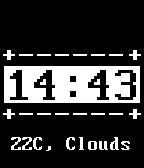

# Watchface Tutorial

Sample project from the Getting Started watchface tutorials.

This is the result of all three parts and is a customized watchface with weather information included. 

**Important**

To obtain weather information, you must supply a value for `myAPIKey` in 
`src/js/app.js`. These are freely available from
[OpenWeatherMap.org](https://openweathermap.org/appid).

